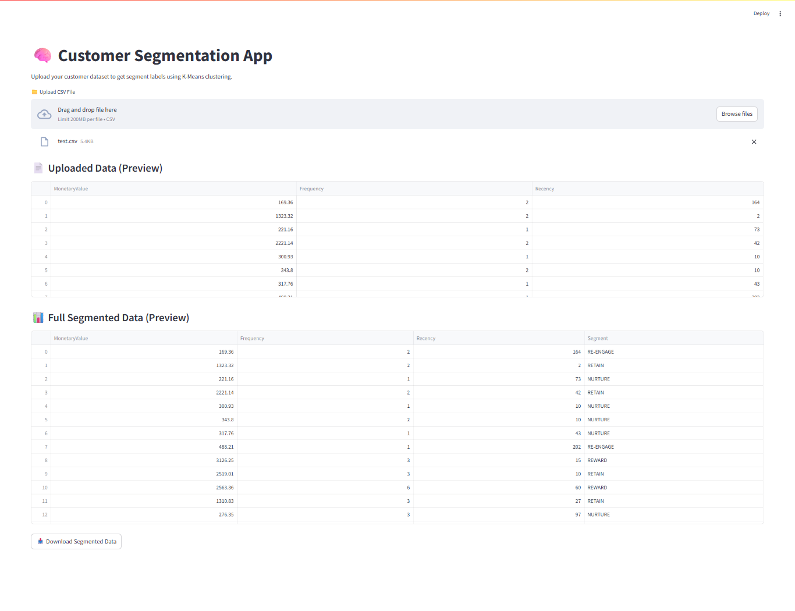

# 8.-Customer-Segmentation-KMeans

🚀 Live Demo
[see live demo](https://custumersegmentationbyzaidnaeem.streamlit.app/)

An AI-powered Streamlit application that performs customer segmentation using unsupervised learning on raw invoice data. This project transforms transactional records into strategic customer insights using K-Means Clustering and RFM (Recency, Frequency, Monetary) analysis.

📊 Problem Statement
Businesses generate tons of transactional data — but how do we turn that into customer intelligence?

This app helps companies:

Identify loyal, at-risk, and high-value customers

Personalize marketing strategies

Boost retention, engagement, and ROI

🔍 Features
🧾 Raw Invoice Input: Accepts raw transactional data (Invoice, Quantity, InvoiceDate, Price, Customer ID)

🛠️ Feature Engineering: Automatically calculates:

Recency – Days since last purchase

Frequency – Total transactions per customer

MonetaryValue – Total spending

🤖 K-Means Clustering: Groups customers into behavior-based segments

🏷️ Business Labels: Cluster outputs mapped to meaningful segments:

diff
Copy
Edit
0 – RETAIN
1 – RE-ENGAGE
2 – NURTURE
3 – REWARD
-1 – PAMPER
-2 – UPSELL
-3 – DELIGHT
📥 File Upload + Download: Upload your data → Download segmented CSV

🖥️ Streamlit UI: Fully interactive, scrollable tables for preview and full dataset

🧰 Tech Stack
Python 🐍

pandas, numpy

scikit-learn (StandardScaler, KMeans)

Streamlit 🌐

joblib (for model persistence)
